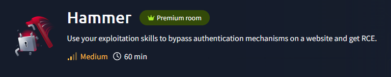
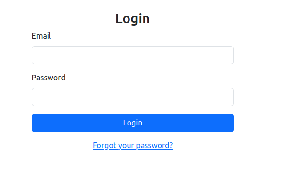

# Hammer


## Introduction
- This challenge is the last room from the module Authentication so we expect to apply the knowledge we learned from the past rooms.

## Active recon
- Doing a simple nmap scan on the target
    ```
    root@ip-10-10-74-56:~# nmap -T4 thm.ham
    Starting Nmap 7.80 ( https://nmap.org ) at 2025-06-22 10:52 BST
    Nmap scan report for thm.ham (10.10.176.14)
    Host is up (0.0067s latency).
    Not shown: 999 closed ports
    PORT   STATE SERVICE
    22/tcp open  ssh
    MAC Address: 02:36:10:64:94:6F (Unknown)

    Nmap done: 1 IP address (1 host up) scanned in 0.46 seconds

- Not finding a lot with the quick scan so i decide to do a more complete scan

    ```
    root@ip-10-10-74-56:~# nmap thm.ham -A -p- -T4 -sS -oN fscan_hammer.txt
    Starting Nmap 7.80 ( https://nmap.org ) at 2025-06-22 11:01 BST
    Nmap scan report for thm.ham (10.10.176.14)
    Host is up (0.00061s latency).
    Not shown: 65533 closed ports
    PORT     STATE SERVICE VERSION
    22/tcp   open  ssh     OpenSSH 8.2p1 Ubuntu 4ubuntu0.11 (Ubuntu Linux; protocol 2.0)
    1337/tcp open  http    Apache httpd 2.4.41 ((Ubuntu))
    | http-cookie-flags: 
    |   /: 
    |     PHPSESSID: 
    |_      httponly flag not set
    |_http-server-header: Apache/2.4.41 (Ubuntu)
    |_http-title: Login
    MAC Address: 02:36:10:64:94:6F (Unknown)
    No exact OS matches for host (If you know what OS is running on it, see https://nmap.org/submit/ ).
    TCP/IP fingerprint:
    OS:SCAN(V=7.80%E=4%D=6/22%OT=22%CT=1%CU=34870%PV=Y%DS=1%DC=D%G=Y%M=023610%T
    OS:M=6857D4AD%P=x86_64-pc-linux-gnu)SEQ(SP=102%GCD=1%ISR=108%TI=Z%CI=Z%II=I
    OS:%TS=A)OPS(O1=M2301ST11NW7%O2=M2301ST11NW7%O3=M2301NNT11NW7%O4=M2301ST11N
    OS:W7%O5=M2301ST11NW7%O6=M2301ST11)WIN(W1=F4B3%W2=F4B3%W3=F4B3%W4=F4B3%W5=F
    OS:4B3%W6=F4B3)ECN(R=Y%DF=Y%T=40%W=F507%O=M2301NNSNW7%CC=Y%Q=)T1(R=Y%DF=Y%T
    OS:=40%S=O%A=S+%F=AS%RD=0%Q=)T2(R=N)T3(R=N)T4(R=Y%DF=Y%T=40%W=0%S=A%A=Z%F=R
    OS:%O=%RD=0%Q=)T5(R=Y%DF=Y%T=40%W=0%S=Z%A=S+%F=AR%O=%RD=0%Q=)T6(R=Y%DF=Y%T=
    OS:40%W=0%S=A%A=Z%F=R%O=%RD=0%Q=)T7(R=Y%DF=Y%T=40%W=0%S=Z%A=S+%F=AR%O=%RD=0
    OS:%Q=)U1(R=Y%DF=N%T=40%IPL=164%UN=0%RIPL=G%RID=G%RIPCK=G%RUCK=G%RUD=G)IE(R
    OS:=Y%DFI=N%T=40%CD=S)

    Network Distance: 1 hop
    Service Info: OS: Linux; CPE: cpe:/o:linux:linux_kernel

    RACEROUTE
    HOP RTT     ADDRESS
    1   0.61 ms thm.ham (10.10.176.14)

    OS and Service detection performed. Please report any incorrect results at https://nmap.org/submit/ .
    Nmap done: 1 IP address (1 host up) scanned in 28.20 seconds

- We can see a second service (http) open on port 1337, let's access it from our navigator with this url `http://<ip>:1337`


- The first thing i'm doing is looking a the source code and BINGO there is a sus comment 
    `<!-- Dev Note: Directory naming convention must be hmr_DIRECTORY_NAME -->`

- We are probably going to need to do some subdomain enumeration but first I want to inspect the login request with burp. While opening burp I remark the "forgot password" feature, I try with a random email and we can already see a vulnerability: Verbose errors. We could try to enumerate valid emails by bruteforcing the reset password page.

- After multiple tries my script seems to not work correctly with the webapp so I decide to start the directory enumeration with ffuf

    root@ip-10-10-97-139:~# ffuf -w /usr/share/wordlists/SecLists/Discovery/Web-Content/raft-small-words.txt -u http://thm.hammer:1337/hmr_FUZZ -s
    images
    logs
    js
    css
    .phps


- When browsing to this url `http://<ip>:1337/hmr_logs/` I see file name error.logs so I decide to look at it, and how happy am I when I see this email tester@hammer.thm failing to authenticate to the admin panel. Now that I have an email let's try to use the reset password feature with this email to find the password.

- After multiple attemps I resigned to use someone else script's, (I don't want to be the master of script kiddies so I will probably update the wu when I'll redo this box) Props to Matsec for his script 
https://github.com/MatSec21/HammerTHM/blob/abc121ccb61f832ebe33becf4063189d9482dd75/bruteforcecodes.py

- The script gave me this password: Password123, now we just need to use the following credentials to get the user flag tester@hammer.thm:Password123

*What is the flag value after logging in to the dashboard?*
**Q1.1** - `THM{AuthBypass3D}`
