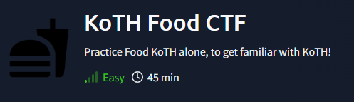

# KoTH Food CTF

GET ALL 8 FLAGS

    Using default creds got this user/pass and flag
    MySQL [users]> select * from User;
    +----------+---------------------------------------+
    | username | password                              |
    +----------+---------------------------------------+
    | ramen    | noodlesRTheBest                       |
    | flag     | thm{2f30841ff8d9646845295135adda8332} |
    +----------+---------------------------------------+

    Using the creds above to connect to SSH
        moving to /home/bread we got a second flag
