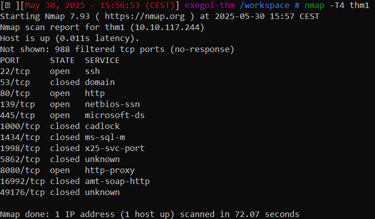
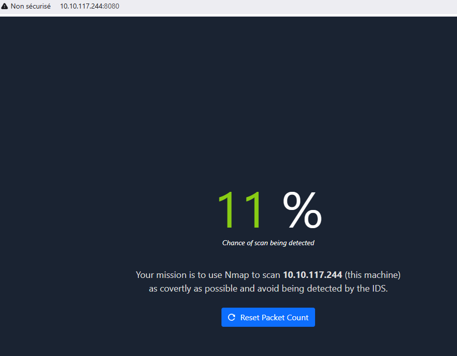
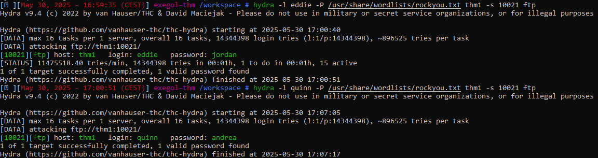
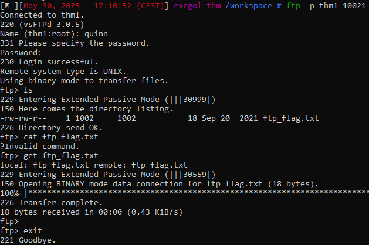
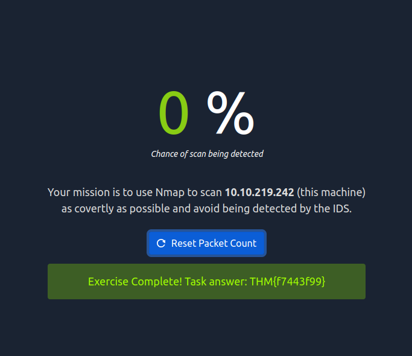

# Net Sec Challenge

## Introduction 
- In the introduction of the box it is said that "this challenge can be solved using only nmap, telnet, and hydra" so we are going to focus on these in the next steps, let's dive into the recon.

## Active recon (part 1)
- I'm editing the /etc/hosts file and then i'm scanning with the command below :

- With this result we can answer the first question, however I don't see any open port above 10000, so I decide to scan all the possible ports with this flag : -p 10000-65535
*What is the highest port number being open less than 10,000?*
**Q2.1** - `8080`

- Meanwhile I'm exploring the web app and I find the page below.

- For some reason my scan is going to take more then half an hour so I decide to stop it. I'm guessing that I'm either missing a specific scenario from the past rooms of the Network Security module or I'm too impatient (could be both).

- I decide to look for some writeups because at the time I was thinking "I'm missing knowledge, it's probably the IDS (or IPS ?) from above that is detecting me" Now knowing the port that I'm missing I scan this specific port which is giving me the result below : 

- Now that we know the open port above 10000 we have all the elements to answer the two next questions.

*There is an open port outside the common 1000 ports; it is above 10,000. What is it?*
**Q2.2** -  `10021`
*How many TCP ports are open?*
**Q2.3** -  `5 + 1 =6` 

## Active recon (part 2)
- We are now looking for a flag hidden in the HTTP server header, refering to the last modules we knows that we can connect via telnet on the web application and get the raw response wich includes the server header.
 *Don't forget to press enter after sending the GET request*

*What is the flag hidden in the HTTP server header?*
**Q2.4** -  `THM{web_server_25352}`

- Same process for the next question but now instead of the web server header (port 80 by default) we want the ssh server header (port 22 by default).

*What is the flag hidden in the SSH server header?*
**Q2.5** -  `THM{946219583339}` 

- We are now looking for the version of an FTP server listening on a nonstandard port. Referring back to our nmap scans, there is one particular port that stands out from the usual range: port 10021. By performing a more detailed scan on this specific port, we will obtain the version.

*We have an FTP server listening on a nonstandard port. What is the version of the FTP server?*
**Q2.6** -  `vsftpd 3.0.5`

- We are now given 2 usernames and we need to find the flag, in one of these two account files accessible via FTP.
It's instantly remembering me the last room of the Network Security Module which was focusing on brute forcing with Hydra.
Thanks to exegol i get the my last command starting with hydra suggested however I need to figure out how to specify the port number. (using the -s flag)

- We have now 2 loggins with their own password so let's try to connect to it and get the flag.
I connect with the first login and password but I don't find anything, so I decide to try the second one
 *After retrieving the flag on our machine we can cat the file*

*We learned two usernames using social engineering: eddie and quinn. What is the flag hidden in one of these two account files and accessible via FTP?*
**Q2.7** -  `THM{321452667098}`

## Active recon (part 3)
- We are now heading to http://thm1:8080. This is the web page shown earlier, and our goal is to solve the challenge, which involves performing a scan that won’t be detected by the IDS. After many scans (and some help), I found the correct solution.
 

- I've done the same scan from my machine and it didn't work, so it's better to do the scan with the attack box for this question.

*Browsing to http://MACHINE_IP:8080 displays a small challenge that will give you a flag once you solve it. What is the flag?*
**Q2.8** -  `THM{f7443f99}`
