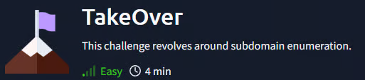

# TakeOver

## Introduction
- I'm editing the etc/hosts file to start with, as suggested in the Hint from the introduction. From what we can read we know that it will be only about doing subdomain enumation so let's get into it 
IMPORT : SUPPORT information

FINISH THIS WU