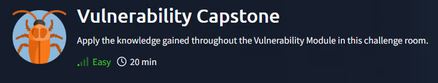
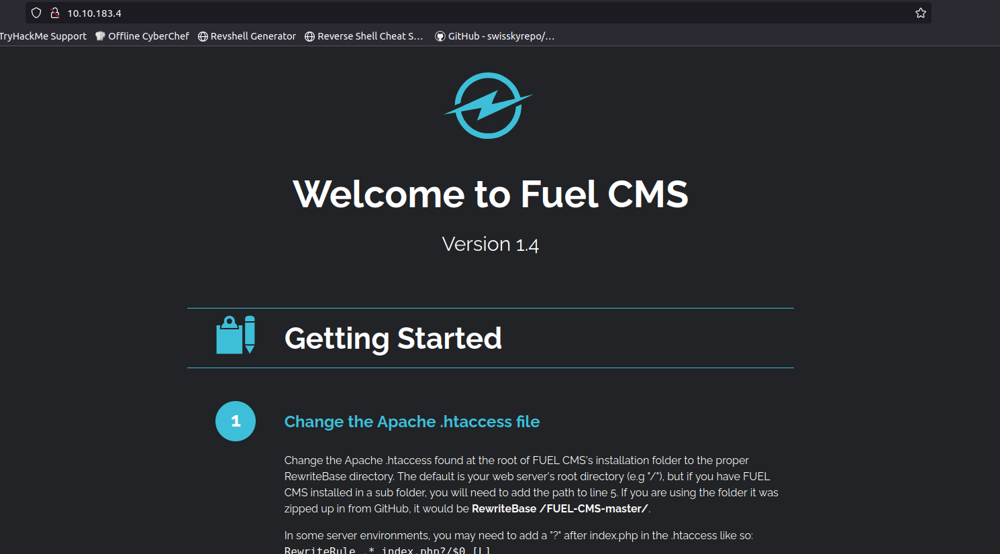
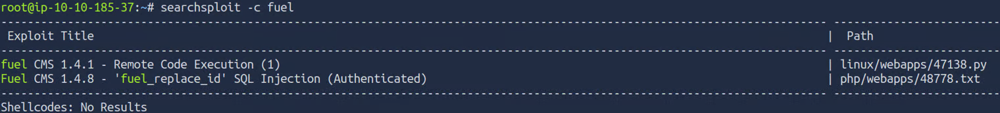
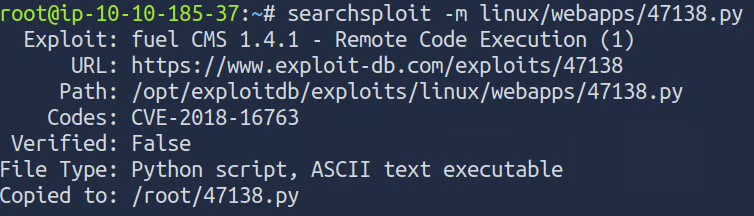
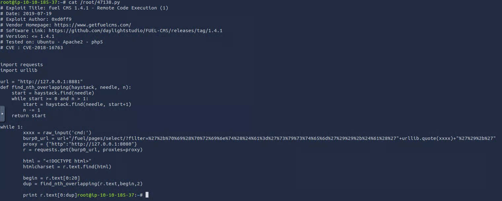
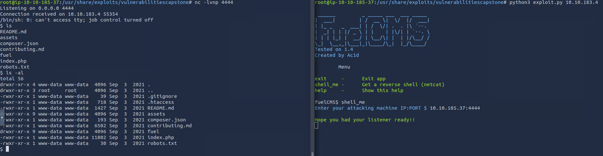

# Vulnerability Capstone

## Introduction
- This box is about applying the knowledge we learned from the last two rooms. It will likely involve using the tool SearchSploit on a web application. I'm using the attackbox because it is recommended to use it to complete this room.

# Active recon
- I'm doing a simple scan to identify the port where is running the web application.
    `22/tcp open ssh`
    `80/tcp open http`
- This is the default port for a web app so I just need to type http://<ip>/  in the url.

- We're looking for the name of the application and its version. I think it's pretty self-explanatory, so I won't say much more.

*What is the name of the application running on the vulnerable machine?*
**Q2.2** - `Fuel CMS` 
*What is the version number of this application?*
**Q2.3** - `1.4`

- We want to know the number of the CVE tha allows a RCE on this application. Let's use Searchsploit as we learned to use from the past room.

- There are 2 exploits exactly corresponding to the web app's version, and only one RCE available. Let's use the path to learn more from this specific exploit.

*What is the number of the CVE that allows an attacker to remotely execute code on this application?*
**Q2.4** - `CVE-2018-16763`

- Let's inspect the code to then configure the exploit and use it.

- I tried to run the exploit, but I encountered an error. Then I fixed a typo and ran it again, but there was still another mistake, so I had to fix it again. However it was still not working, looking at question  five I knew that it was probably not the right exploit. So looked for the hint and got this path :
`/usr/share/exploits/vulnerabilitiescapstone`
There is a juicy exploit sitting in this directory, let's try to use it.

- After a few mistakes I finally get the reverse shell, now we just need to find the flag located in /home/unbuntu/ 

*What is the value of the flag located on this vulnerable machine? This is located in /home/ubuntu on the vulnerable machine.*
**Q2.6** - `THM{ACKME_BLOG_HACKED}`